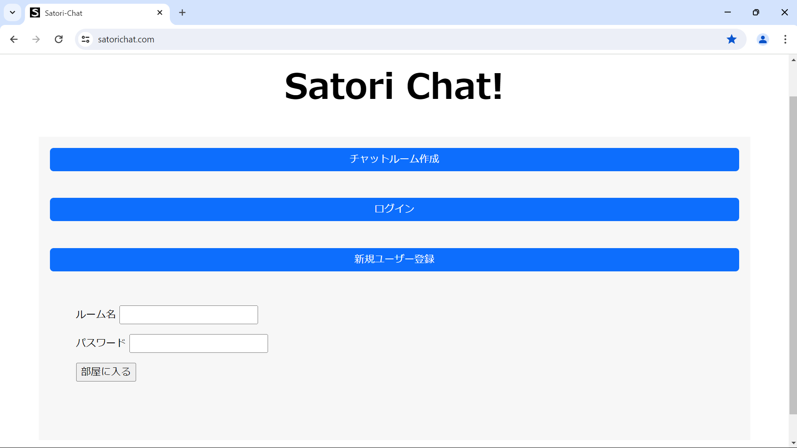
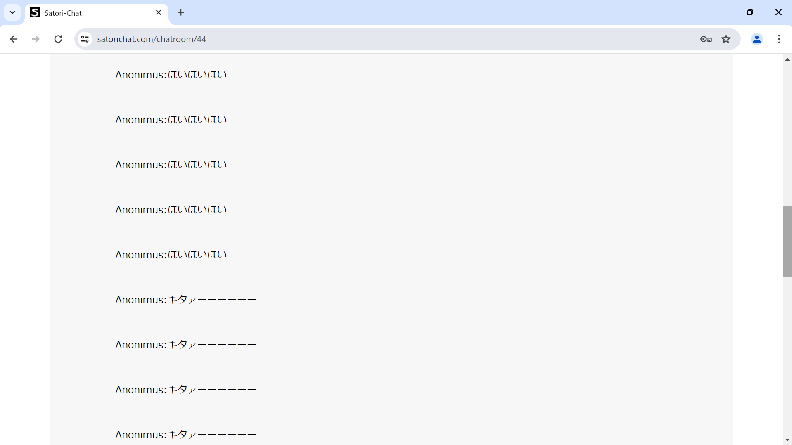
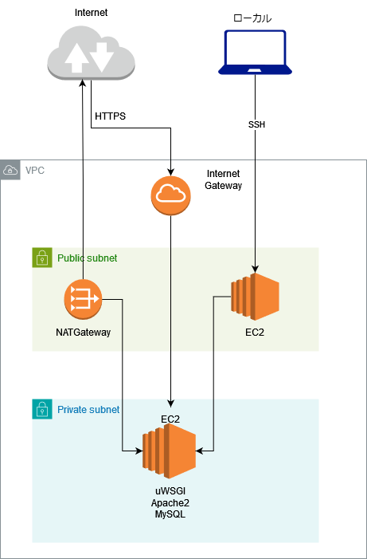

# github
タイトルFlaskを使用してチャットアプリを作成して、Webアプリについて学習をしました！
## アプリの概要
サーバーサイドにPython、フレームワークのFlask、インフラにAWS、サーバーソフトウェアにApache2、WSGIにuWSGIを使用し、GithubとCodeDeployを使用して半自動でデプロイ可能な環境を構築しました。
url(https://satorichat.com #AWSの費用が高額になってしまったので5月7日をもってアプリの公開を停止しました…)
## アプリの機能
 - チャット機能(CRUD)
 - ユーザー登録機能
 - 認証機能
 - セッション管理機能
 - ゲスト機能（認証をせずともゲストルームでAnonymusとしてチャットが可能）
### アプリの画面

## 使用技術
### サーバーソフトウェア
  - DB:MySQL
  - Apache2
### フロントエンド
 - html/css,bootstrap
### バックエンド
 - python3
### pythonモジュール
  - flask 3.0.2
  - Jinja2-3.1.3
  - Werkzeug-3.0.1
  - uwsgi
  - flask_wtf 1.2.1
  - flask_login 0.6.3
  - flask_sqlalchemy 3.1.2
  - pymysql1.1.0
  - typing extensions 4.9.0
  - argon2-cffi1.16.0
### インフラ
 - EC2, Codedeploy, Route53, ACM, IAM
## ネットワーク構成図

